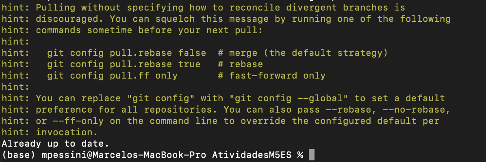
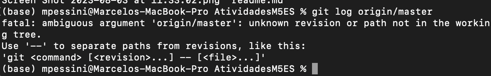
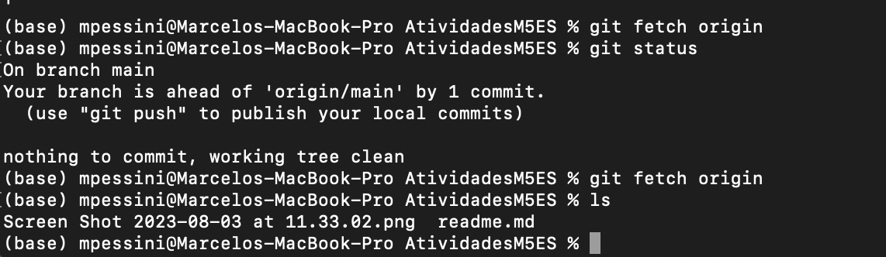
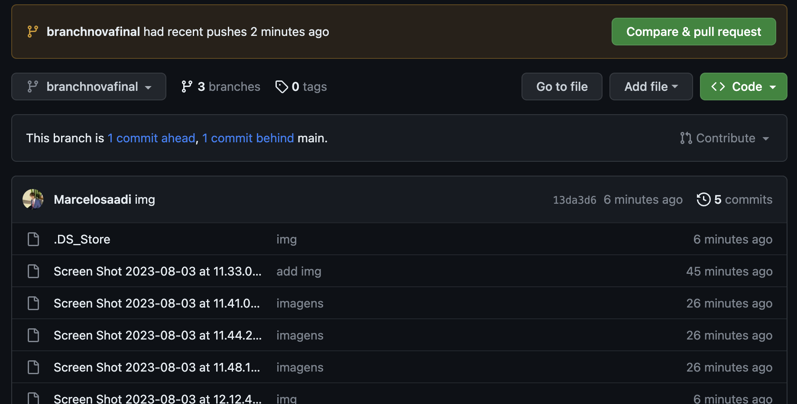

<h1>Github Get Started</h1>

Inicialmente, na secção github get started criei o repositório pelo github web, e clonei o repositório na minha máquina:

O git log/origin deu esse resultado pois ainda não commitei nada. Igualmente com o comando de merge, pois apenas tenho uma branch.

 Seguem os prints dos comandos git aplicados durante o tiutor

Registro de pull:

Registro de log:

Utilização do fetch:

Push com commit:
(nao entendi por que a foto do push:commit nao foi)

Criação e acesso a uma nova branch:

